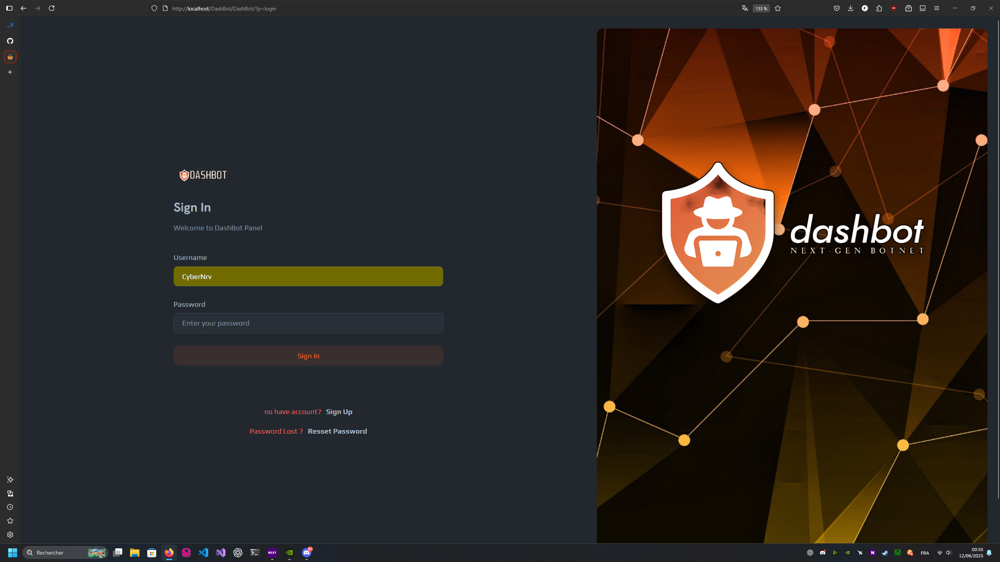
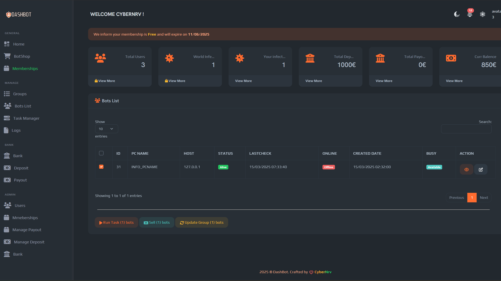

CONTACT ME ON HF OR ON TELEGRAM : CYBERNRV for get a Betatester for free 

beta tester found : 3/10

Beta : 15/08/2025
Release : 30/11/2025

we are looking for 10 beta testers we currently have 3. your job is to test our solution in real time for 15 days and give us feedback with ideas for improvements. as a reward we offer beta testers a lifetime license

# Welcome to Dashbot 💀

Dashbot is a panel designed to manage PCs compromised by a FUD malware unique to each user. This undetectable malware updates itself automatically to remain elusive, even to the authorities.

## Malware Description
This malware is coded to be unalterable, with 6 private security systems making it impenetrable. A dynamic code system allows remote modifications only for the purpose of improvement.

## Remote Control Features
Here are the obscure features you can trigger from the panel to sow chaos:

- **F_POWERSHELL / F_CMD**: Execute cmd or powershell commands with an administration bypass.
- **F_KEYLOGGERS**: Logs keystrokes, processes and allows you to customize the size of the logs and their expiration.
 - **F_PASSWORD RECOVERY**: Recovers browser passwords, credit cards, Discord tokens, and other sensitive information for maximum exploitation.
- **F_RANSOMWARE**: Deploys silent ransomware to encrypt files and extort a ransom.
- **F_CHAT**: Live chat with the victim via Tawk.to, undetectable.
- **F_DLEXEC**: Executes .exe or .dll payloads without leaving any traces, with or without administrative rights.

- **F_UNIS**: This feature permanently removes the malware, but its use requires a level 2 subscription or special administrator authorization to avoid any potential backlash.

 - **F_CLOSE**: When enabled, this feature abruptly shuts down the target, plunging the enemy into darkness and total helplessness,
😈🔥
- **F_DDOS**: Triggers powerful and unique DDoS attacks to cause massive damage. Here are some available attack methods:
- **UDP**: Floods the target with UDP packets to saturate its bandwidth.
- **SPOOF UDP**: Uses spoofed IP addresses to hide the origin of the attack.
- **NTP AMP**: Amplify NTP requests to increase the intensity of the attack.
- **CHARGEN AMP**: Uses the CHARGEN service to amplify requests.
- **SSDP**: Uses the SSDP protocol to flood the target.
- **SSH AUTH FLOOD**: Floods the target with SSH authentication attempts.
 - **SYN** : Launches a SYN attack to saturate the server resources.
- **SYNACK** : Sends SYN-ACK packets to overload the target.
- **Custom Minecraft Scripts** : Specific attacks to disrupt Minecraft servers.

## Exclusive Control
Only CyberNRV has the power to update the malware and manage all the required services. The Control Panel can be accessed here: [dashbot.ink](http://dashbot.ink/). The source code and data are not stored directly on the link to preserve maximum security.

## Malware Startup and Behavior
On startup, the malware connects to 200 servers to retrieve the final server after careful checks, making it unstoppable. It has a silent startup, an automatic versioning system, and three authorization options: normal user, forceadmin and Silentbypass.

 The malware is coded in two parts: the LOADER in C# .NET Framework as an executable and the malware as a DLL. It is distributed encrypted on multiple servers, downloaded from the loader, decrypted and executed in memory. It uses direct system calls, anti-EDR, anti-VM and anti-sandbox mechanisms to avoid analysis.

With these fearsome features, the malware is ready to sow chaos and destruction. May your evil reign extend without limits, oh master of darkness. 😈🔥nd manage all required services. The Control Panel can be accessed here: [dashbot.ink](http://dashbot.ink/). The source code and data are not stored directly on the link to maintain maximum security.

With Dashbot by your side, digital tyranny has no limits. Let destruction and perversion reign supreme. 😈🔥
